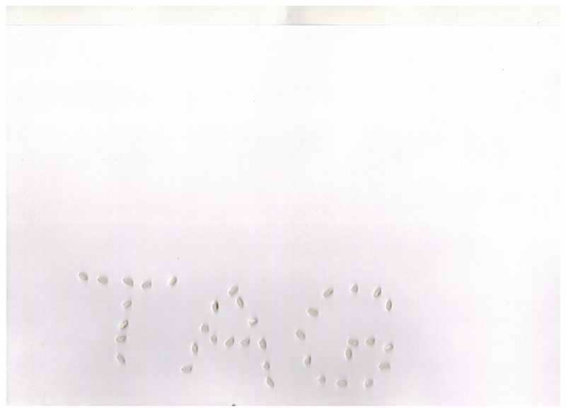
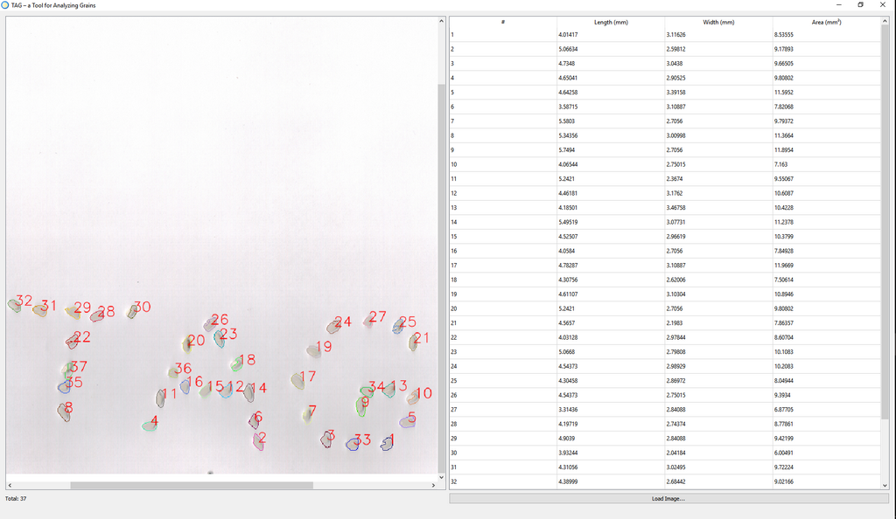
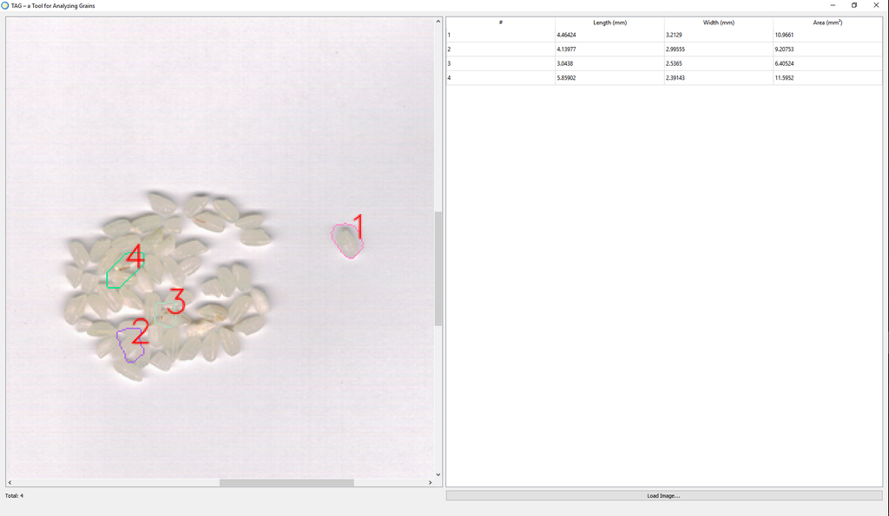

##  TAG - a Tool for Analysing Grains 

TAG is a practice project at the ITMO University. The tool allows users to analyze grains (get their size, area, and total number). 

*Note: TAG is hardcoded to work well only with the images from Brother DCP-1512R scanner*

## Screenshots

Here's an image scanned on Brother DCP-1512R with 300 DPI:

After the processing, TAG will look like this:

Right now, the algorithm works well only on separate rice grains. You can see the result of an attempt to use it to recognize touching grains below:

## Third-party Components

The project is developed using [Qt](https://www.qt.io/) (Qt Creator + Qt Designer).
Icon made by [Freepik](https://www.freepik.com/) from www.flaticon.com.
